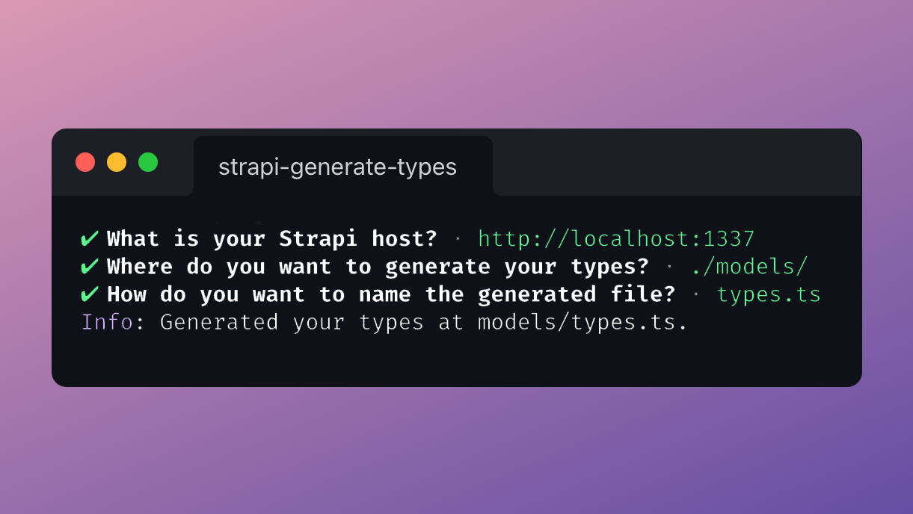

# strapi-generate-types

[![npm version][npm-version-src]][npm-version-href]
[![npm downloads][npm-downloads-src]][npm-downloads-href]
[![License][license-src]][license-href]

> CLI to generate types based on your [Strapi](https://strapi.io) API content types.

- [✨ &nbsp;Release Notes](https://github.com/stun3r/strapi-generate-types/releases)

## Features

- Generate Typescript's types based on your content types
- Ease-of-use thanks a beautiful prompt

## Getting started

### ⏳ Installation

```bash
yarn add strapi-generate-types
```

**or**

```bash
npm install --save strapi-generate-types
```

### 🖐 Requirements

In order to use this generator you must have installed the GraphQL plugin **on your Strapi API**.

```bash
yarn strapi install graphql
```

For more informations see the [GraphQL plugin](https://strapi.io/documentation/developer-docs/latest/development/plugins/graphql.html) 

### 🕹 Usage

The prompt will ask you 3 things:

1. First, the host of your Strapi API with which you want to generate your types (default: `http://localhost:1337`).
2. Then, where you want to generate it (default: `./models/`).
3. Finally, the name of the file which will be generated (default: `types.ts`)

Enjoy 🎉

## License

[MIT License](./LICENSE)

<!-- Badges -->
[npm-version-src]: https://img.shields.io/npm/v/strapi-generate-types/latest.svg?style=flat-square
[npm-version-href]: https://npmjs.com/package/strapi-generate-types

[npm-downloads-src]: https://img.shields.io/npm/dt/strapi-generate-types.svg?style=flat-square
[npm-downloads-href]: https://npmjs.com/package/strapi-generate-types

[license-src]: https://img.shields.io/npm/l/strapi-generate-types.svg?style=flat-square
[license-href]: ./LICENSE